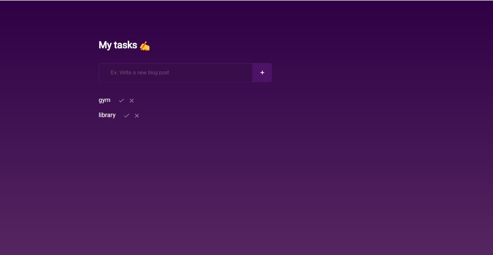

**Todo Application**

**Introduction**

This **Todo Application** is designed to help users efficiently manage
their daily tasks. With a user-friendly interface and responsive design,
it allows you to stay organized and on top of your schedule. Users can
easily add, edit, delete, and view tasks, making day-to-day task
management seamless.

**Features**

-   **Add Tasks**: Quickly add new tasks to your daily schedule with a
    simple input form.

-   **Edit Tasks**: Modify existing tasks with updated information if
    plans or details change.

-   **Delete Tasks**: Remove tasks that have been completed or are no
    longer needed.

-   **View Tasks**: Display a clear list of all scheduled tasks for the
    day, organized for easy readability.

**Technologies Used**

-   **React**: The application is built with React, leveraging hooks
    such as useState and useEffect for state management and lifecycle
    control.

-   **Bootstrap**: Ensures the application is fully responsive across
    all devices, providing a mobile-friendly interface with modern UI
    components.

-   **React Icons**: The app uses icons from the React Icon Library to
    improve usability and enhance the interface with visually appealing
    buttons and elements.

**Usage**

Once the app is running, you can:

-   **Add a task** by typing a task name and description and clicking
    the \"Add\" button.

-   **Edit a task** by clicking the edit icon next to the task.

-   **Delete a task** by clicking the delete icon.

-   **Mark tasks as completed** to keep track of your progress.

